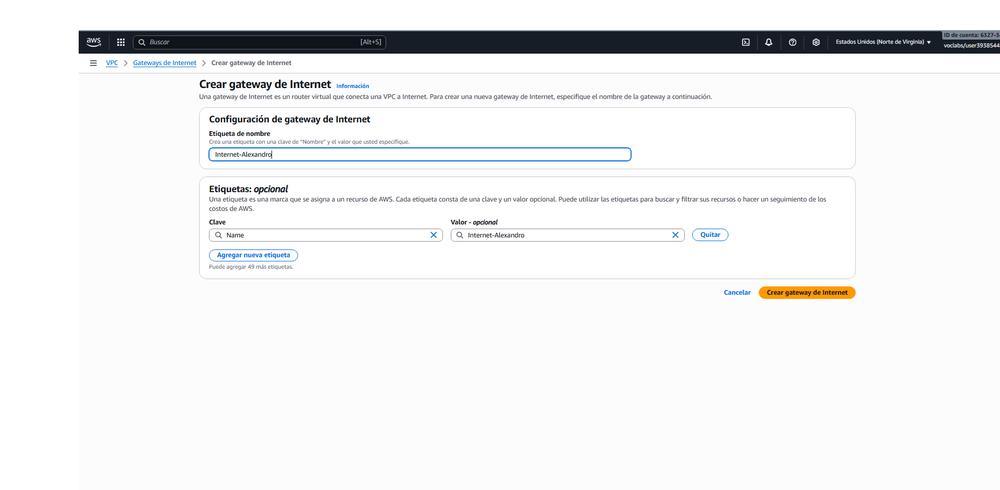
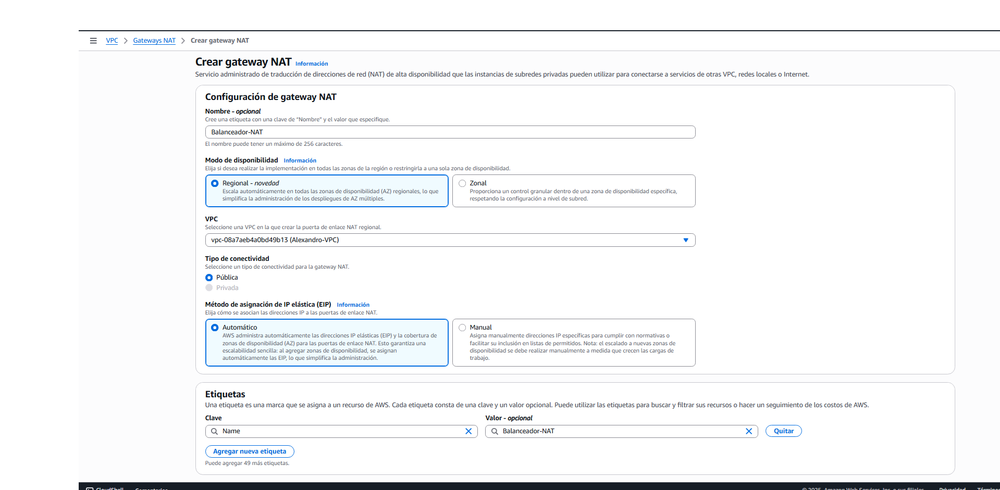
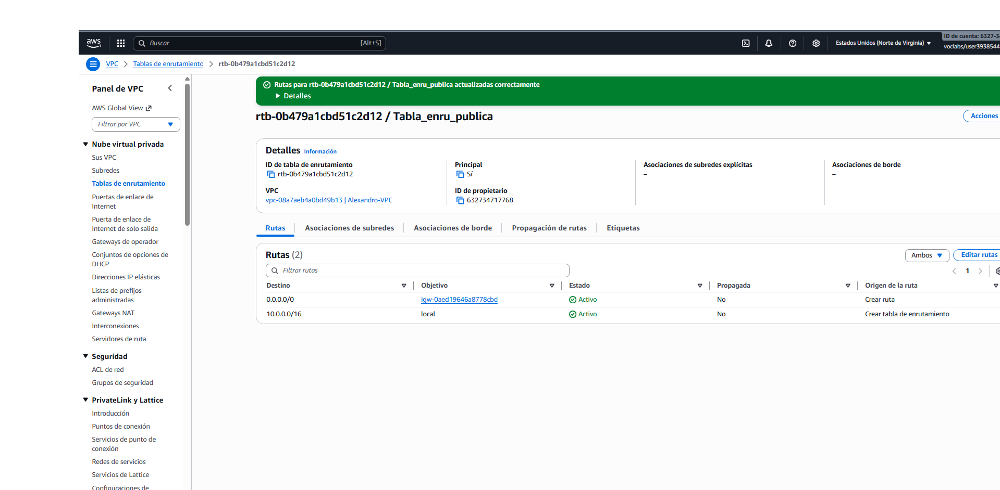
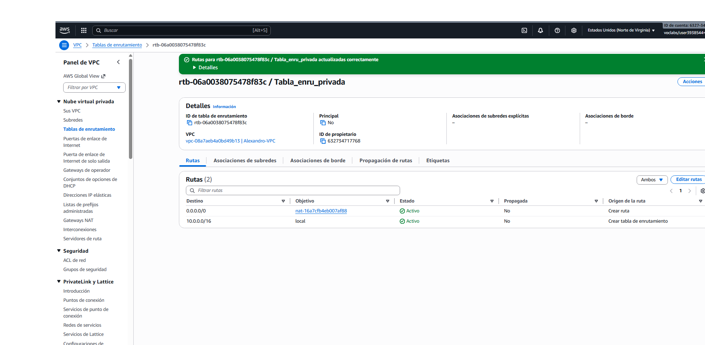
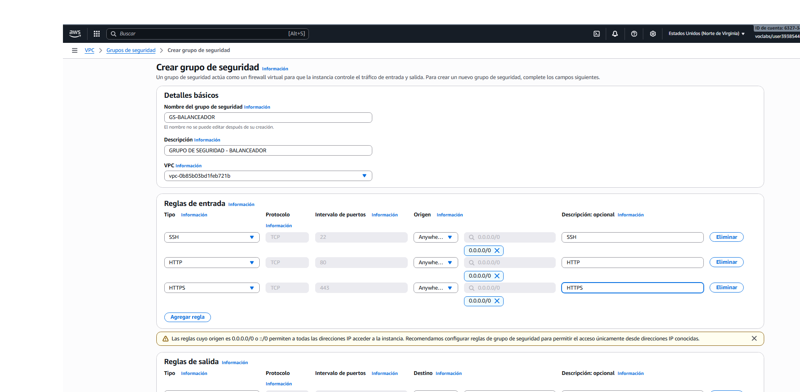
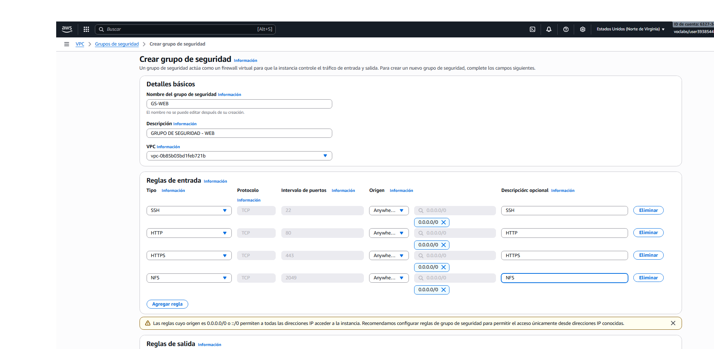
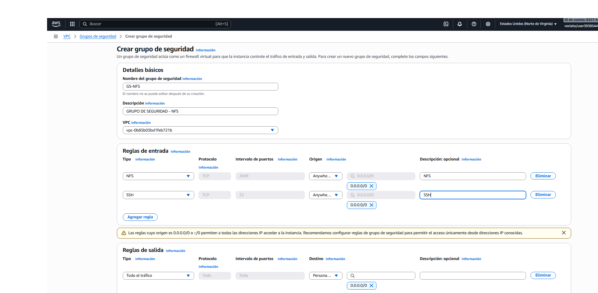
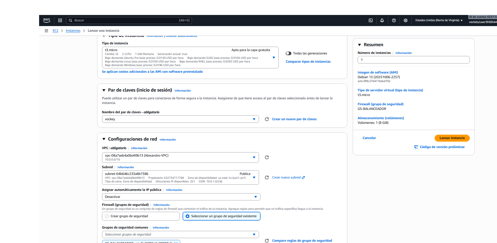
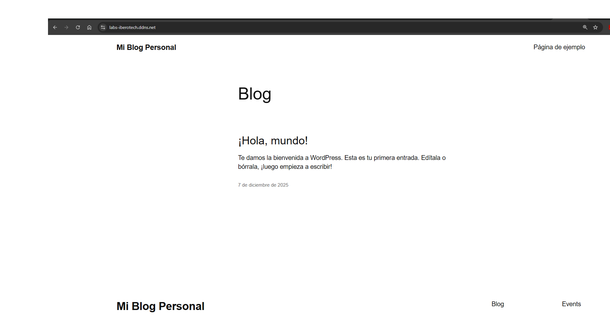

# Despliegue de Infraestructura en AWS en 3 Capas

Este documento describe el proceso paso a paso para desplegar una infraestructura en AWS, configurando una VPC con subredes públicas y privadas, así como las instancias necesarias para un sistema de balanceo de carga, web, NFS y base de datos.

## Índice

1. [Crear VPC](#-crear-vpc)
2. [Crear Subredes](#-crear-subredes)
3. [Crear Internet Gateway](#-crear-internet-gateway)
4. [Crear Tablas de Enrutamiento](#-crear-tablas-de-enrutamiento)
5. [Crear Grupos de Seguridad](#-crear-grupos-de-seguridad)
6. [Lanzar Instancias](#-lanzar-instancias)
7. [Comprobación](#-comprobación)

## 📋 Crear VPC

1. **Buscador AWS** → **VPC** → **Crear VPC**
   - **Nombre**: `Alexandro-VPC`
   - **CIDR IPv4**: `10.0.0.0/16`
     

## 🖧 Crear Subredes

1. **VPC** → **Subredes** → **Crear subred**
   - **Nombre**: `Publica`
   - **Subred CIDR IPv4**: `10.0.1.0/24`
  

2. **VPC** → **Subredes** → **Crear subred**
   - **Nombre**: `Privada Web y NFS`
   - **Subred CIDR IPv4**: `10.0.2.0/24`

3. **VPC** → **Subredes** → **Crear subred**
   - **Nombre**: `Privada BD`
   - **Subred CIDR IPv4**: `10.0.3.0/24`
  

## 🌐 Crear Internet Gateway

1. **VPC** → **Puerta de enlace de internet** → **Crear Gateway de internet**
2. **VPC** → **Internet Gateways** → **Crear Gateway NAT**

## 🔄 Crear Tablas de Enrutamiento

1. **VPC** → **Crear Tablas de enrutamiento**
   - **Nombre**: `Tabla_enru_publica`
   - **VPC**: Selecciona la VPC creada en el paso anterior

2. **VPC** → **Crear Tablas de enrutamiento**
   - **Nombre**: `Tabla_enru_privada`
   - **VPC**: Selecciona la VPC creada en el paso anterior
  

## 🔐 Crear Grupos de Seguridad

1. **VPC** → **Grupos de seguridad** → **Crear grupo de seguridad**
   - **Balanceador**

   - **Web**

   - **NFS**

   - **Base de Datos**

## 🚀 Lanzar Instancias

1. **Balanceador**: Lanzar la instancia del balanceador de carga.

2. **NFS**: Lanzar la instancia de NFS.

3. **Web1 y Web2**: Lanzar las instancias de servidores web.

4. **BD**: Lanzar la instancia de base de datos.

## ✅ Comprobación

- **Accede a la infraestructura aquí**: [Acceder a la infraestructura](https://labs-iberotech.ddns.net/)

